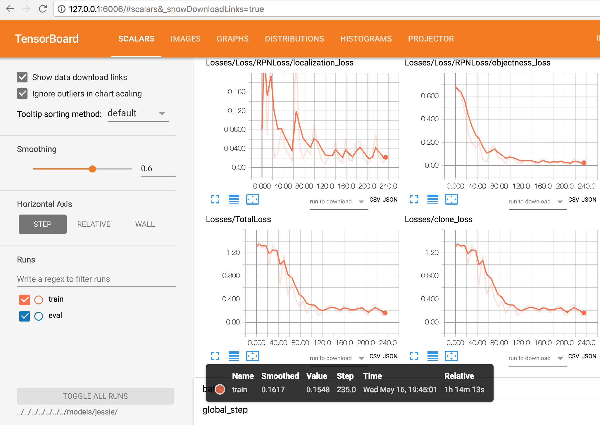
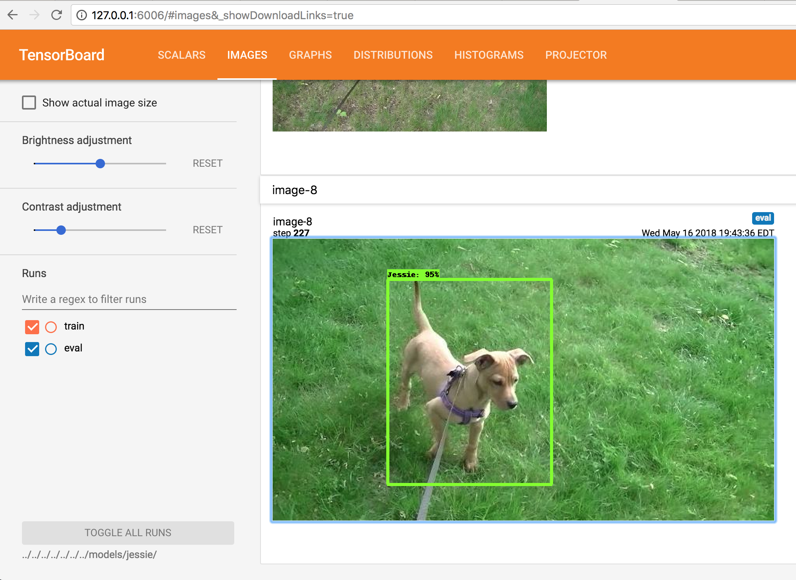
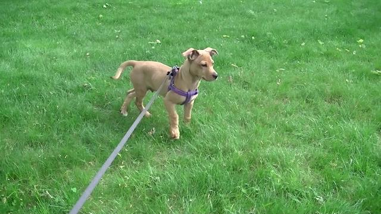

# Video Object Capture

This is a proof-of-concept (PoC) project (still work in progress) on how one
could use Google's Tensorflow to train and use neural network on detecting
objects in a video stream and display a frame around the object on the screen
displaying the video.


## Training

The first step is to train the neural network. For that purpose we need to
acquire a set of raw training images, classify the object(s) in the images,
and actually training the neural network.


### Acquiring of Training images

I decided that for this PoC I will use my HD video camera to record footage of
the object I care about in a variety of lighting conditions, distance, angle
and background. Once I felt satisfied that I have enough footage, I downloaded
the individual scenes to my Mac, and using iMove cut out the parts I did not
want and spliced the remaining scenes together and exported it as mpeg4 file
in 720 HD.

The next step was to extract the individual frames out of the video so that
the images could be annotated. In order to extract the frames, I wrote a Python
script that uses OpenVPC to extract the images and resizes them. You can see it
[here](https://github.com/petr-undercover/video_object_detection/blob/master/video_frame_extract/README.md).

Note that depending on the length of video file, this can produce a large number
of JPEGs. Use the `--skip n` option to extract every n-th frame. After that I
manually reviewed the image files and deleted those that I did not want.


### Annotating of Training Images

For image labeling I found the `labelImg` on the internet that produces
annotations in the Pascal VOC format but for whatever reason, I could not get
it installed and running on my Mac. After looking around I opted for an easy
way out by getting the `RectLabel` [image annotation tool](https://rectlabel.com/)
by Ryo Kawamura in the Apple App Store for $0.99.


### Creating of Training Dataset

We will be using the
[Tensorflow Object Detection API](https://github.com/tensorflow/models/tree/master/research/object_detection)
 from now on. This requires an installation of additional pre-requisites into our
environment.  This installation consists of the following steps:

* Installation of the protobuf compiler (can be done with Homebrew)
```
$ brew install protobuf
```

* Installation of the [TensorFlow research models](https://github.com/tensorflow/models).
This repo contains among other things the TensorFlow Object Detection API
```
$ cd ./venv/lib/python2.7/site-packages/tensorflow
$ git clone https://github.com/tensorflow/models.git
```

* Installation of COCO API Installation as documented [here](https://github.com/tensorflow/models/blob/master/research/object_detection/g3doc/installation.md)

Note that the pip-installable pre-requisites are captured in the requirements.txt
but you may still want to check the documentation of the COCO API in case there
were changes.
```
$ cd video_object_detection
$ git clone https://github.com/cocodataset/cocoapi.git
$ cd cocoapi/PythonAPI
$ make
$ cp -r pycocotools ../../venv/lib/python2.7/site-packages/tensorflow/models/research/
```

* Protobuf Compilation as documented in the object_detection installation
```
$ cd ./venv/lib/python2.7/site-packages/tensorflow/models/research
$ protoc object_detection/protos/*.proto --python_out=.
```

* Adding Libraries to PYTHONPATH as documented in the object_detection installation
```
$ cd ./venv/lib/python2.7/site-packages/tensorflow/models/research
$ export PYTHONPATH=$PYTHONPATH:`pwd`:`pwd`/slim
```

* Testing the Installation as documented in the object_detection installation
```
$ cd ./venv/lib/python2.7/site-packages/tensorflow/models/research
$ python object_detection/builders/model_builder_test.py
```

At this point the environment should be ready for creation of the training dataset
in the TFRecord file format. I borrowed the `create_pascal_tf_record.py` file
from `models/research/object_detection/dataset_tools` and customized it for my
own needs. You can find it here: `./TRFecord_prep/create_pascal_tf_record.py`.

The gist of my changes is how the code finds the training file, how it handles
the file path. The following is the label map `label.pbtxt` file that I defined
for my training annotated images (in my case only annotating my dog Jessie):
```
item {
 id: 1
 name: 'Jessie'
}
```

Note that I intentionally picked a high number hoping to avoid collision with
other ID's used in some of the pre-trained models that I am planning to use for
the actual training. If you were going to train one from scratch, it would not
matter.

I then created the training data set by executing the following command:
```
$ cd TFRecord_prep
$ python create_pascal_tf_record.py --data_dir=../workspace --label_map_path=../data/label.pbtxt --output_path=../data
```

The resulting training file is this `./data/pascal_train.record` and the resulting
validation file is this `./data/pascal_eval.record`.

### Training Neural Network

For the actual training we will use two directories that follow the recommended
directory structure for training and evaluation:
```
./data/
./data/label.pbtxt
./data/pascal_value.record
./data/pascal_train.record
./models/
./models/jessie/
./models/jessie/faster_rcnn_resnet101_coco.config
./models/jessie/train/
./models/jessie/eval/
```

Rather than starting from scratch and investing the time and the computational
resources, I decided to start with one of the pre-trained detection models. The
description of these can be found [here](https://github.com/tensorflow/models/blob/master/research/object_detection/g3doc/detection_model_zoo.md).

For this project I chose the `faster_rcnn_inception_v2_coco` and downloaded
the tar file from [here](http://download.tensorflow.org/models/object_detection/faster_rcnn_inception_v2_coco_2018_01_28.tar.gz).

The tar file contains the following files:
```
./checkpoint
./frozen_inference_graph.pb
./model.ckpt.data-00000-of-00001
./model.ckpt.index
./model.ckpt.meta
./pipepline.config
./saved_model/saved_model.pb
```

At this point we need to move the various files into the right position. The
checkpoint files will go into `./models/jessie/train/` directory. You could use
a command like this from the un-tar directory:

```
$ cp model.ckpt.* [PATH_TO_THIS_PROJECT]/models/jessie/train/
```

The configuration file will go in to the `./models/jessie/` directory:

```
$ mv pipepline.config [PATH_TO_THIS_PROJECT]/models/jessie/faster_rcnn_resnet101_coco.config.old
```

However, I ended up using the newer version of this file from the samples:

`./venv/lib/python2.7/site-packages/tensorflow/models/research/object_detection/samples/configs/faster_rcnn_resnet101_coco.config`

and just updated the hyper-parameters to be consistent with those downloaded
with the pre-trained model.

Then update the config file by setting the number of classes to 1 (remember I am
adding one). Also there are various placeholder for absolute path to the
checkpoint directory, the training dataset, the evaluation data set, and the
label map.

Now it is time to kick of the local jobs! The following  [information](https://github.com/tensorflow/models/blob/master/research/object_detection/g3doc/running_locally.md)
was used to determine how to kick off the local jobs.

Running the Training job locally:
```
$ cd ./venv/lib/python2.7/site-packages/tensorflow/models/research/
$ python object_detection/train.py \
      --logtostderr \
      --pipeline_config_path=../../../../../../../models/jessie/faster_rcnn_resnet101_coco.config \
      --train_dir=../../../../../../../models/jessie/train/
```
Note that by default, the training job will run indefinitely until the user kills it.

Running the Evaluation job locally (separate terminal window):
```
$ cd ./venv/lib/python2.7/site-packages/tensorflow/models/research/
$ python object_detection/eval.py \
      --logtostderr \
      --pipeline_config_path=../../../../../../../models/jessie/faster_rcnn_resnet101_coco.config \
      --checkpoint_dir=../../../../../../../models/jessie/train/ \
      --eval_dir=../../../../../../../models/jessie/eval/
```

Running the Tensorboard to inspect the Evaluation and Training jobs:
```
$cd ./venv/lib/python2.7/site-packages/tensorflow/models/research/
$ tensorboard --logdir=../../../../../../../models/jessie/
```

I ran the training on my MacBookPro (no GPU) but was able to observe after
some time on the TensorBoard decrease in the Total Loss:



Under Images on the TensorBoard you can observe evaluation recognizing objects:




### Gotchas

* I opened additional terminals to run the other two jobs and activated the
  virtualenv. However, I forgot to export the PYTHONPATH for `pwd`/slim.
* One of the jobs kept crashing with a strange error (Python is not installed
  as a framework. The Mac OS X backend will not be able to function correctly
  if Python is not installed as a framework. See the Python documentation for
  more information on installing Python as a framework on Mac OS X. Please
  either reinstall Python as a framework, or try one of the other backends.).
  To fix that I ended up following [this direction](https://stackoverflow.com/questions/21784641/installation-issue-with-matplotlib-python?utm_medium=organic&utm_source=google_rich_qa&utm_campaign=google_rich_qa).


### Exporting Trained Model For Inference

After your model has been trained, you should export it to a Tensorflow graph
proto using the following command:

```
$ cd ./venv/lib/python2.7/site-packages/tensorflow/models/research/
$ python object_detection/export_inference_graph.py \
    --input_type image_tensor \
    --pipeline_config_path ../../../../../../../models/jessie/train/pipeline.config \
    --trained_checkpoint_prefix ../../../../../../../models/jessie/train/model.ckpt-1339 \
    --output_directory ../../../../../../../models/jessie/export/
```

Note the `1339` is specific to my run of TensorFlow training and was the highest
checkpoint number in my training directory. You should now see a new set of files
in the export directory looking like this:

```
./checkpoint
./frozen_inference_graph.pb
./model.ckpt.data-00000-of-00001
./model.ckpt.index
./model.ckpt.meta
./pipeline.config
./saved_model/saved_model.pb
./saved_model/variables/
```

## Object Detection

Once the model was created/trained, and it was exported as a frozen inference
graph, we can use it for object detection. The following script will allow for
identifying trained object(s) in a supplied image, adding a rectangle around it
and saving it in place of the original image.  

This is how you can use it:

```
$ cd ./video_frame_detect
$ python idetect.py ../models/jessie/export/frozen_inference_graph.pb ../data/label.pbtxt frame64.jpg
```

This is how the image looks like before detection:



This is how it looks like after detection:


TODO
