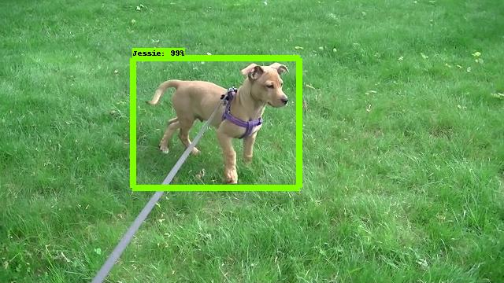

# Video Object Capture

The purpose of this research project is to show the amount of effort needed
to create an accurate machine learning model that would be able to identify
and locate objects in a video stream and see how close to real-time it can
get. It leverages TensorFlow Object Detection API, TensorFlow and a number of
other open source libraries.

The project is based on the Common Object in Context (COCO) dataset, the
Faster R-CNN with Resnet-101 (v1) configuration and is still a work-in-progress.


## Training

The first step in this endeavor was to decide what objects to identify and to
train the neural network. For this purpose I need to acquire a set of raw
training images, classify the object(s) in these images, and actually train the
model.


### Acquiring of Training images

In order to collect a decent amount of image I decided that I will use my HD
video camera to record footage of the object I care about in a variety of
lighting conditions, distance, angle and background. Once I felt satisfied that
I have enough footage, I downloaded the individual scenes to my Mac. Using iMove
I cut out the parts I did not want and spliced the remaining scenes together
and exported it as mpeg4 file in 720 HD definition.

Next I extracted the individual frames out of the video so that the images could
be annotated. In order to extract the frames, I wrote a Python script that uses
OpenVPC to extract the images and resizes them.

You can see it
[here](https://github.com/petr-undercover/video_object_detection/blob/master/video_frame_extract/README.md).

Note that depending on the length of video file, this can produce a large number
of JPEGs. I added the `--skip n` option to extract every n-th frame. Once I
extracted individual frames, I manually reviewed the image files and deleted
those that I did not want.


### Annotating of Training Images

For image labeling I found the `labelImg` open source software that produces
annotations in the Pascal VOC format. However, I could not get it installed and
running correctly on my Mac. After looking around some more I opted for an easy
way out by getting the `RectLabel` [image annotation tool](https://rectlabel.com/)
by Ryo Kawamura in the Apple App Store for $0.99.


### Creating of Training Dataset

Next I had to get the [Tensorflow Object Detection API](https://github.com/tensorflow/models/tree/master/research/object_detection)
installed along with all its dependencies. This installation consists of the
following steps:

* Installation of the protobuf compiler (can be done with Homebrew)
```
$ brew install protobuf
```

* Installation of the [TensorFlow research models](https://github.com/tensorflow/models).
```
$ cd ./venv/lib/python2.7/site-packages/tensorflow
$ git clone https://github.com/tensorflow/models.git
```

* Installation of COCO API Installation as documented in [here](https://github.com/tensorflow/models/blob/master/research/object_detection/g3doc/installation.md)

Note that the pip-installable pre-requisites are captured in the requirements.txt
but you may still want to check the documentation of the COCO API in case there
were changes.
```
$ cd video_object_detection
$ git clone https://github.com/cocodataset/cocoapi.git
$ cd cocoapi/PythonAPI
$ make
$ cp -r pycocotools ../../venv/lib/python2.7/site-packages/tensorflow/models/research/
```

* Protobuf Compilation as documented in the object_detection installation
```
$ cd ./venv/lib/python2.7/site-packages/tensorflow/models/research
$ protoc object_detection/protos/*.proto --python_out=.
```

* Adding Libraries to PYTHONPATH as documented in the object_detection installation
```
$ cd ./venv/lib/python2.7/site-packages/tensorflow/models/research
$ export PYTHONPATH=$PYTHONPATH:`pwd`:`pwd`/slim
```

* Testing the Installation as documented in the object_detection installation
```
$ cd ./venv/lib/python2.7/site-packages/tensorflow/models/research
$ python object_detection/builders/model_builder_test.py
```

At this point the environment should be ready for creation of the training dataset
in the TFRecord file format. I borrowed the `create_pascal_tf_record.py` file
from `models/research/object_detection/dataset_tools` and customized it for my
own needs. You can find it here: `./TRFecord_prep/create_pascal_tf_record.py`.

The gist of my changes is how the code finds the training file, how it handles
the file path, and separating the dataset for training and evaluation. The
following is the label map `label.pbtxt` file that I defined for my training
annotated images (in my case the only annotating was for my dog):
```
item {
 id: 1
 name: 'Jessie'
}
```

I then created the training data set by executing the following command:
```
$ cd TFRecord_prep
$ python create_pascal_tf_record.py --data_dir=../workspace --label_map_path=../data/label.pbtxt --output_path=../data
```

The resulting training file is this `./data/pascal_train.record` and the resulting
validation file is this `./data/pascal_eval.record`.


### Model Training

For the actual training I used two directories following the recommended
directory structure for training and evaluation:
```
./data/
./data/label.pbtxt
./data/pascal_value.record
./data/pascal_train.record
./models/
./models/jessie/
./models/jessie/faster_rcnn_resnet101_coco.config
./models/jessie/train/
./models/jessie/eval/
```

Rather than starting from scratch and investing the time and the computational
resources, I decided to start with one of the pre-trained detection models. The
description of these can be found [here](https://github.com/tensorflow/models/blob/master/research/object_detection/g3doc/detection_model_zoo.md).

The model I picked was the `faster_rcnn_inception_v2_coco` and I downloaded
the tar file from [here](http://download.tensorflow.org/models/object_detection/faster_rcnn_inception_v2_coco_2018_01_28.tar.gz).

The tar file contains the following files:
```
./checkpoint
./frozen_inference_graph.pb
./model.ckpt.data-00000-of-00001
./model.ckpt.index
./model.ckpt.meta
./pipepline.config
./saved_model/saved_model.pb
```

After extracting the files from the archive, I moved the model checkpoint files
into the right position. The checkpoint files will go into `./models/jessie/train/`
directory. You could use a command like this from the un-tar directory:

```
$ cp model.ckpt.* [PATH_TO_THIS_PROJECT]/models/jessie/train/
```

I could have used the configuration file that came with the model located in the  
`./models/jessie/` directory:

```
$ mv pipepline.config [PATH_TO_THIS_PROJECT]/models/jessie/faster_rcnn_resnet101_coco.config.old
```

But instead I decided it to use its newer version from the samples and adjust
the hyper-parameters to be consistent with those downloaded with the pre-trained
model:

`./venv/lib/python2.7/site-packages/tensorflow/models/research/object_detection/samples/configs/faster_rcnn_resnet101_coco.config`

I also updated the config file by setting the number of classes to 1 (remember
I am adding just one object class). Additional I set the various placeholder for
absolute path to the checkpoint directory, the training dataset,
the evaluation data set, and the label map.

At this point I was ready to kick of the training by starting the local jobs!
I used the following  [information](https://github.com/tensorflow/models/blob/master/research/object_detection/g3doc/running_locally.md) to determine how to kick these off.

Running the Training job locally:
```
$ cd ./venv/lib/python2.7/site-packages/tensorflow/models/research/
$ python object_detection/train.py \
      --logtostderr \
      --pipeline_config_path=../../../../../../../models/jessie/faster_rcnn_resnet101_coco.config \
      --train_dir=../../../../../../../models/jessie/train/
```
Note that by default, the training job will run indefinitely until the user kills it.

Running the Evaluation job locally (separate terminal window):
```
$ cd ./venv/lib/python2.7/site-packages/tensorflow/models/research/
$ python object_detection/eval.py \
      --logtostderr \
      --pipeline_config_path=../../../../../../../models/jessie/faster_rcnn_resnet101_coco.config \
      --checkpoint_dir=../../../../../../../models/jessie/train/ \
      --eval_dir=../../../../../../../models/jessie/eval/
```

Running the Tensorboard to inspect the Evaluation and Training jobs:
```
$cd ./venv/lib/python2.7/site-packages/tensorflow/models/research/
$ tensorboard --logdir=../../../../../../../models/jessie/
```

I ran the training on my MacBookPro (no GPU) but was able to observe after
some time on the TensorBoard decrease in the Total Loss:


Under Images on the TensorBoard you can observe evaluation recognizing objects:


### Gotchas

* I opened additional terminals to run the other two jobs and activated the
  virtualenv. However, I forgot to export the PYTHONPATH for `pwd`/slim. After
  correcting that, I was able to get everything running fine.
* One of the jobs kept crashing with a strange error (Python is not installed
  as a framework. The Mac OS X backend will not be able to function correctly
  if Python is not installed as a framework. See the Python documentation for
  more information on installing Python as a framework on Mac OS X. Please
  either reinstall Python as a framework, or try one of the other backends.).
  To fix that I ended up following [this direction](https://stackoverflow.com/questions/21784641/installation-issue-with-matplotlib-python?utm_medium=organic&utm_source=google_rich_qa&utm_campaign=google_rich_qa).


### Exporting Trained Model For Inference

After about 24-hours of training when the TotalLoss got to the shown range, I
killed the jobs and decided to export the model. I used the following command:

```
$ cd ./venv/lib/python2.7/site-packages/tensorflow/models/research/
$ python object_detection/export_inference_graph.py \
    --input_type image_tensor \
    --pipeline_config_path ../../../../../../../models/jessie/train/pipeline.config \
    --trained_checkpoint_prefix ../../../../../../../models/jessie/train/model.ckpt-1339 \
    --output_directory ../../../../../../../models/jessie/export/
```

Note the `1339` is specific to my run of TensorFlow training and was the highest
checkpoint number in my training directory. You should now see a new set of files
in the export directory looking like this:

```
./checkpoint
./frozen_inference_graph.pb
./model.ckpt.data-00000-of-00001
./model.ckpt.index
./model.ckpt.meta
./pipeline.config
./saved_model/saved_model.pb
./saved_model/variables/
```

The exported model is available in [this archive](./models/jessie/exported_model.tgz).


## Object Detection

Now that the model was created/trained, and it was exported as a frozen inference
graph, I was ready to use it for object detection. I created the following script
for identifying trained object(s) in a supplied image, adding a rectangle around it
and saving it in place of the original image.  

This is how you can use it:

```
$ cd ./video_frame_detect
$ python idetect.py ../models/jessie/export/frozen_inference_graph.pb ../data/label.pbtxt frame64.jpg
```

This is how the image looked like before detection:


This is how it looked like after detection:



I also wrote the `vdetect.py` script that reads in an mp4 file, extract one
frame after another, subject the frame to object detection, modifies the frame
by adding bounding boxes around the detected objects and writes the frame out
to another video file. This demonstrates how this could be done in a video
stream. The following is an example of a command to run this:

```
$ cd ./video_frame_detect
$ python vdetect.py ../models/jessie/export/frozen_inference_graph.pb ../data/label.pbtxt ../test_video.mp4
```

The following is a link to the original video file. You can also access the mp4
[here](./docs/test_video.mp4).


This link is for the modified video file after detection. You can also access
the video after detection and conversion to mp4 [here](./docs/test_video_detect.mp4).


## Future Enhancements

Right now this process is far from being a real-time process. The next
enhancements should be about optimizing this process. In my testing
on my MacBookPro (3 GHz Intel Core i7, 16 GB 1600 MHz DDR3, 1TB SSD), 28 second
video took about 3 hours and 30 minutes to convert.  Such optimization could
involve picking a different [COCO-trained models](https://github.com/tensorflow/models/blob/master/research/object_detection/g3doc/detection_model_zoo.md) that might perform faster. It could also involve frame sampling, i.e. running
detection on every n-th frame assuming that the objects that we are detecting
do not move fast.

Another enhancement might involve experiment with different codecs to see if we
can keep the output video file approximately the same size as the input video
file, e.g. mp4v - Apple MPEG4 Compressor - compresses images using MPEG4
compression algorithm. I did not consider the first implementation as the speed
was my primary concern and the last thing I wanted was to burn CPU cycles on
MPEG compression. However, if the storage is a concern, this would be important.
In my test the source MPEG 40MB file resulted in 244MB MJPG file (but I was able
to convert it with iMove to 42MB MPEG video).
